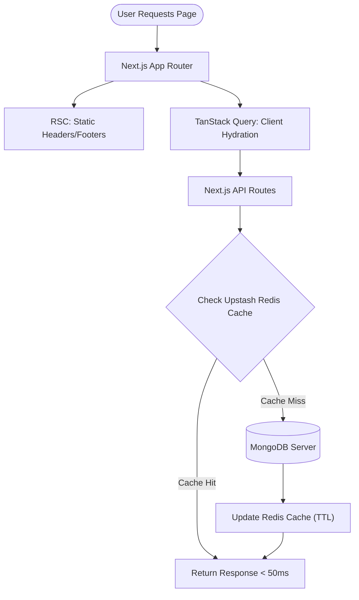
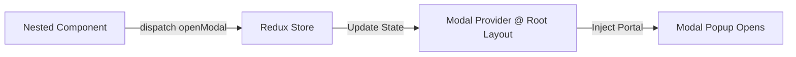

<div align="center">

# 🛠️ Điện Nước Mai Vinh - Modern E-Commerce Catalog

A highly-optimized full-stack web application built with **Next.js 15**, focusing on extreme performance, mobile-first design, and seamless user experience. Designed to showcase modern frontend and backend architectures at enterprise scale.

[](https://nextjs.org/)
[](https://react.dev/)
[](https://www.typescriptlang.org/)
[](https://tailwindcss.com/)
[](https://www.mongodb.com/)
[](https://upstash.com/)

[**✨ View Live Demo**](https://diennuocmaivinh.vercel.app/)

</div>

## 📖 Table of Contents
- [🚀 Key Features](#-key-features)
- [🧠 System Architecture](#-system-architecture)
- [🧠 Core Engineering Problems Solved](#-core-engineering-problems-solved)
- [🎨 Design System & UX Decisions](#-design-system--ux-decisions)
- [💻 Technical Stack Depth](#-technical-stack-depth)
- [⚙️ Getting Started](#-getting-started)

---

## 🚀 Key Features

### 1. Hybrid Rendering & Server Components
- **Static Site Generation (SSG):** Used caching and static building for shells and layout elements.
- **Client-Side Rendering (CSR):** Used React Suspense and TanStack Query to stream dynamic datasets and manage interactive states, lowering Time To Interactive (TTI).

### 2. Micro-Caching with Redis
- Bypassed complex MongoDB aggregations on frequent reads guaranteeing response times typically **`<50ms`**.

### 3. Progressive Web App (PWA)
- Out-of-the-box **PWA setup** supporting installation as a standalone application layout in Android & iOS.

### 4. Admin Dashboard Security (RBAC)
- Role-Based Access Control via **NextAuth.js (Auth.js v5)** and passwordless **Google One-Tap Login**.

---

## 🧠 System Architecture

### 🔄 Data & Caching Flow
This diagram showcases how data fetches leverage multi-level caching abstractions before falling back to the Database.



### 🔲 Centralized Modal Management (Redux)
To keep the DOM tree clean, models are managed through a unified portal rather than nested imports.



---

## 🧠 Core Engineering Problems Solved

### ⚡ 1. Bundle Size Optimization (Hydration issues)
*   **Problem:** Form templates like `ProductFormModal` / `CategoryFormModal` use heavyweight libraries (`React-Hook-Form`, `Zod`, `Cloudinary widget`). Adding them statically inflated Initial bundle sizes by bundle overheads.
*   **Solution:** Centralized `ModalProvider` utilizing Next.js `dynamic()` imports with `ssr: false`. Heavy modalities are lazily packaged in decoupled JS chunks, lowering the Initial First Load JS size to **`~100KB`**.

### 🔄 2. Cache Consistency & Invalidation
*   **Problem:** Stale cache loading when Admin modifies prices, deleting, or adding distinct product nodes.
*   **Solution:** Granular eviction policies clearing targeted cache regions instantly upon Database mutation batches. Users will view exact rates statically consistent without sluggish re-loads.

### 📜 3. Scroll Sync with URL Params
*   **Problem:** Landing from Search direct hits. Traditional client routing lands on full list sets without centering accuracy.
*   **Solution:** Implemented robust `useEffect` algorithms with dynamic scrolling timeouts that paginate index limits smoothly on component mounts, pushing correct viewport bounds automatically.

---

## 🎨 Design System & UX Decisions

### 📱 Mobile-First Controls
- Built auto-collapsible Breadcrumbs relying on `.flex-wrap` algorithms bypassing annoying table layout shifts or overflows.
- Designed finger-friendly tap regions for complex data Pagination streams (`<<`, `<`, page nodes, `>`, `>>`).

### 📦 Clean Interface Transition
- Refactored away traditional **Floating Action Buttons (FAB)** which commonly overlaps vital mobile navigation fields. 
- Installed smooth contextual inline buttons merging seamlessly with top Breadcrumb visual alignment hierarchies.

---

## 💻 Technical Stack Depth

| Layer | Technology |
| :--- | :--- |
| **Framework** | Next.js 15 (React 19), Typescript 5 |
| **Styling** | Tailwind CSS v4, Framer Motion, Lucide |
| **Databases** | MongoDB (Mongoose), Upstash Redis |
| **Auth** | Next-Auth.js (v5), Google One-Tap SDK |
| **State** | Redux Toolkit (Modals), TanStack Query v5 |
| **Heavy Tools** | React Hook Form, Zod, Cloudinary Storage |

---

## ⚙️ Getting Started

### Installation
Clone the repository and install dependencies:
```bash
npm install
```

### Environment Variables (`.env.local`)
```env
# Database
MONGODB_URI=your_mongodb_connection_string

# Upstash Redis Cache
UPSTASH_REDIS_REST_URL=your_redis_url
UPSTASH_REDIS_REST_TOKEN=your_redis_token

# NextAuth Details
NEXTAUTH_URL=http://localhost:3000
NEXTAUTH_SECRET=your_auth_secret
GOOGLE_CLIENT_ID=your_google_id
GOOGLE_CLIENT_SECRET=your_google_secret

# Cloudinary Integration
NEXT_PUBLIC_CLOUDINARY_CLOUD_NAME=your_cloud_name
NEXT_PUBLIC_CLOUDINARY_UPLOAD_PRESET=your_preset
```

### Run Locally
```bash
npm run dev
```
Browse on [http://localhost:3000](http://localhost:3000).

---

*Designed and engineered with passion. Built to demonstrate full-stack problem-solving competence, modern web standards, and high-performance design.*
