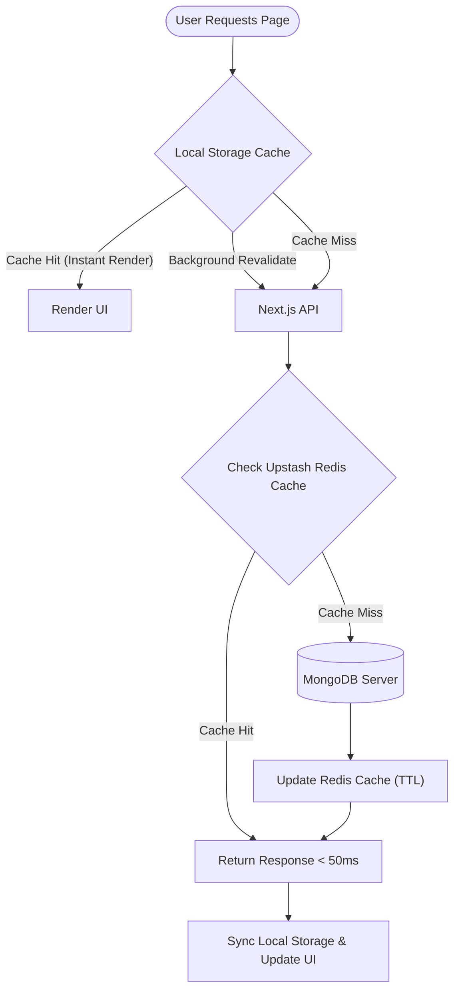
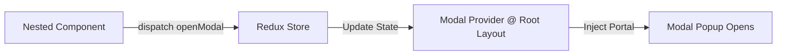

<div align="center">

# 🛠️ Điện Nước Mai Vinh - Modern E-Commerce Catalog

A highly-optimized full-stack web application built with **Next.js 15**, focusing on extreme performance, mobile-first design, seamless user experience, and robust data security. Designed to showcase modern frontend and backend architectures at enterprise scale.

[](https://nextjs.org/)
[](https://react.dev/)
[](https://www.typescriptlang.org/)
[](https://tailwindcss.com/)
[](https://www.mongodb.com/)
[](https://upstash.com/)
[](https://aistudio.google.com/)

[**✨ View Live Demo**](https://diennuocmaivinh.vercel.app/)

</div>

## 📖 Table of Contents
- [🚀 Key Features](#-key-features)
- [🧠 System Architecture](#-system-architecture)
- [🛠️ Core Engineering Problems Solved](#️-core-engineering-problems-solved)
- [🎨 Design System & UX Decisions](#-design-system--ux-decisions)
- [💻 Technical Stack Depth](#-technical-stack-depth)
- [⚙️ Getting Started](#️-getting-started)

---

## 🚀 Key Features

### 1. Hybrid Rendering & Server Components
- **Static Site Generation (SSG):** Heavy use of caching and static building for app shells and layout elements to ensure ultra-fast initial loads.
- **Client-Side Rendering (CSR):** Uses React Suspense and TanStack Query to stream dynamic datasets and manage interactive states, lowering Time To Interactive (TTI).

### 2. Multi-Layered Caching Strategy
- **Upstash Redis Micro-Caching:** Bypassed complex MongoDB aggregations on frequent reads, guaranteeing backend response times typically **`<50ms`**.
- **Persistent Client-Side Caching:** Implemented a robust `stale-while-revalidate` pattern via `localStorage` allowing the app to instantly render cached data upon startup while silently revalidating in the background.

### 3. Professional Quotation & Export
- Built-in capabilities to generate professional quotations with formatted prices (e.g., dynamic unit formatting) and seamless **Excel (`xlsx`) export** for B2B transactions.

### 4. Admin Dashboard & Enterprise Security (RBAC)
- Role-Based Access Control via **NextAuth.js (Auth.js v5)** and passwordless **Google One-Tap Login**.
- **Data Redaction & API Security:** Hardened API layer strictly filters out sensitive properties (like `basePrice`) ensuring they are only transmitted to authenticated administrative users.

---

## 🧠 System Architecture

### 🔄 Data & Caching Flow
This diagram showcases how data fetches leverage multi-level caching abstractions before falling back to the Database.


```mermaid
graph TD
    User([User Requests Page]) --> ClientCache{Local Storage Cache}
    ClientCache -- Cache Hit (Instant Render) --> UI[Render UI]
    ClientCache -- Background Revalidate --> Router[Next.js API]
    ClientCache -- Cache Miss --> Router
    
    Router --> Redis{Check Upstash Redis Cache}
    
    Redis -- Cache Hit --> Return[Return Response < 50ms]
    Redis -- Cache Miss --> Mongo[(MongoDB Server)]
    
    Mongo --> Update["Update Redis Cache (TTL)"]
    Update --> Return
    Return --> SyncClient[Sync Local Storage & Update UI]
```

### 🔲 Centralized Modal Management (Redux)
To keep the DOM tree clean, complex modals are managed through a unified portal rather than nested imports.


```mermaid
graph LR
    Subcomp[Nested Component] -->|dispatch openModal| Store[Redux Store]
    Store -->|Update State| Provider[Modal Provider @ Root Layout]
    Provider -->|Inject Portal| View[Modal Popup Opens]
```

---

## 🛠️ Core Engineering Problems Solved

### ⚡ 1. Bundle Size Optimization (Hydration issues)
*   **Problem:** Form templates and heavyweight libraries (`React-Hook-Form`, `Zod`, `Cloudinary`, Excel exporters) statically inflated Initial bundle sizes.
*   **Solution:** Centralized `ModalProvider` utilizing Next.js `dynamic()` imports with `ssr: false`. Heavy modalities are lazily packaged in decoupled JS chunks, lowering the Initial First Load JS size to **`~100KB`**.

### 🔄 2. Cache Consistency & Invalidation
*   **Problem:** Stale cache loading across the network and client when Admin modifies prices, deleting, or adding distinct product nodes.
*   **Solution:** Granular eviction policies clearing targeted Upstash Redis cache regions instantly upon database mutations. Client-side state automatically synchronizes the freshest data after background revalidation.

### 🛡️ 3. Data Leakage Prevention
*   **Problem:** Accidental exposure of wholesale pricing (`basePrice`) in JSON payloads to standard visitors.
*   **Solution:** Audited and refactored backend API pipelines. Implemented strict role-based data projection, ensuring sensitive fields are stripped at the server level before serialization for non-admin requests.

### 📜 4. Scroll Sync & Fluid Navigation
*   **Problem:** Landing from Search direct hits without centering accuracy. Visual glitches when opening models over scrollable areas.
*   **Solution:** Implemented robust `useEffect` algorithms with dynamic scrolling timeouts that paginate index limits smoothly on component mounts. Dynamic `z-index` backdrop dimming ensures the sidebar and header seamlessly fall behind active overlays.

---

## 🎨 Design System & UX Decisions

### 📱 Mobile-First Controls
- Built auto-collapsible Breadcrumbs relying on `.flex-wrap` algorithms to prevent table layout shifts.
- Dynamic mobile browser status bar coloring synchronized with the application's header theme color via Next.js `viewport` metadata.
- Designed finger-friendly tap regions for complex data Pagination streams (`<<`, `<`, page nodes, `>`, `>>`).

### 📦 Clean Interface Transition
- Refactored away traditional **Floating Action Buttons (FAB)** which commonly overlap vital mobile navigation fields. 
- Installed smooth contextual inline buttons merging seamlessly with top Breadcrumb visual alignment hierarchies.
- Synchronized grid layouts between 'Favorites' and category galleries for pixel-perfect structural consistency.

---

## 💻 Technical Stack Depth

| Layer | Technology |
| :--- | :--- |
| **Framework** | Next.js 15 (React 19), TypeScript 5 |
| **Styling** | Tailwind CSS v4, Framer Motion, Lucide React |
| **Databases** | MongoDB (Mongoose), Upstash Redis |
| **Auth & Security** | Next-Auth.js (v5), Google One-Tap SDK |
| **State & Fetching** | Redux Toolkit (Modals), TanStack Query v5 |
| **Utilities** | React Hook Form, Zod, Excel generation (`xlsx-js-style`), Image Compression |
| **Integrations** | Cloudinary Storage, Google Gemini AI (`@google/genai`) |

---

## ⚙️ Getting Started

### Installation
Clone the repository and install dependencies:
```bash
npm install
```

### Environment Variables (`.env.local`)
```env
# Database
MONGODB_URI=your_mongodb_connection_string

# Upstash Redis Cache
UPSTASH_REDIS_REST_URL=your_redis_url
UPSTASH_REDIS_REST_TOKEN=your_redis_token

# NextAuth Details
NEXTAUTH_URL=http://localhost:3000
NEXTAUTH_SECRET=your_auth_secret
GOOGLE_CLIENT_ID=your_google_id
GOOGLE_CLIENT_SECRET=your_google_secret

# Cloudinary Integration
NEXT_PUBLIC_CLOUDINARY_CLOUD_NAME=your_cloud_name
NEXT_PUBLIC_CLOUDINARY_UPLOAD_PRESET=your_preset

# Google Gemini API
GEMINI_API_KEY=your_gemini_api_key
```

### Run Locally
```bash
npm run dev
```
Browse on [http://localhost:3000](http://localhost:3000).

---

*Designed and engineered with passion. Built to demonstrate full-stack problem-solving competence, modern web standards, and high-performance design.*
